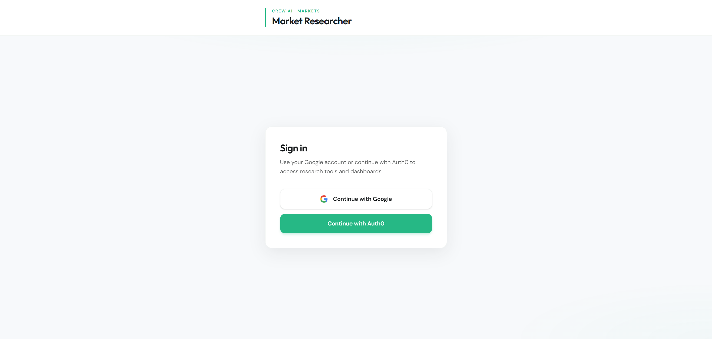
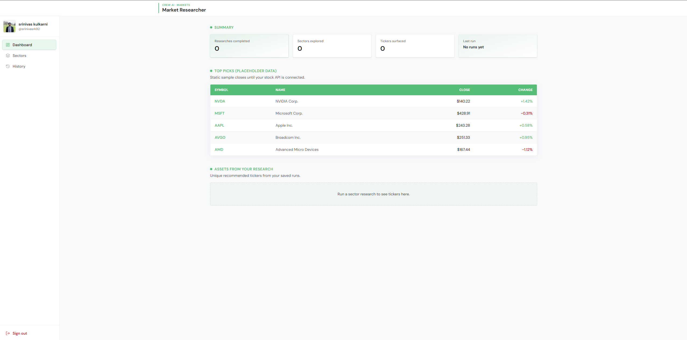
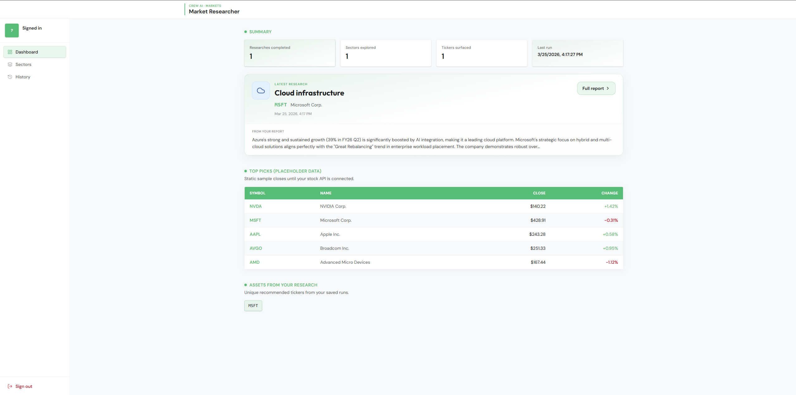
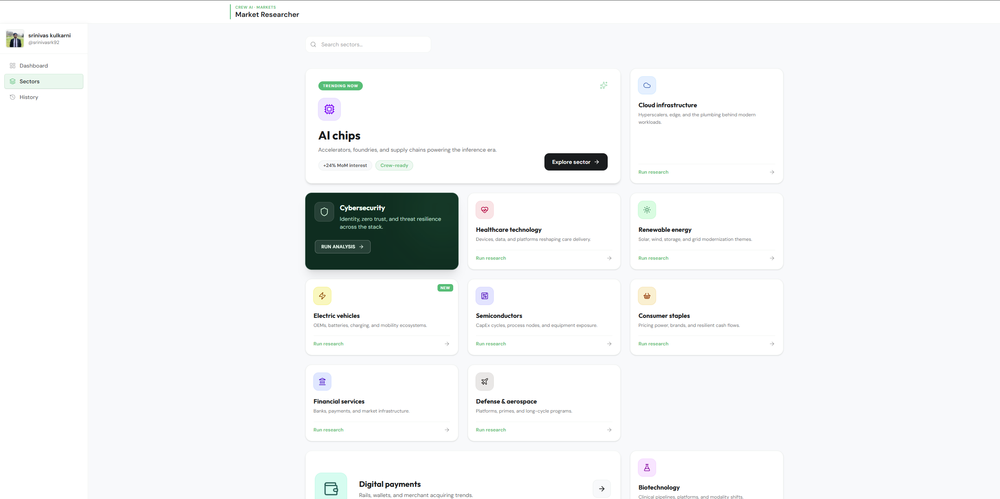
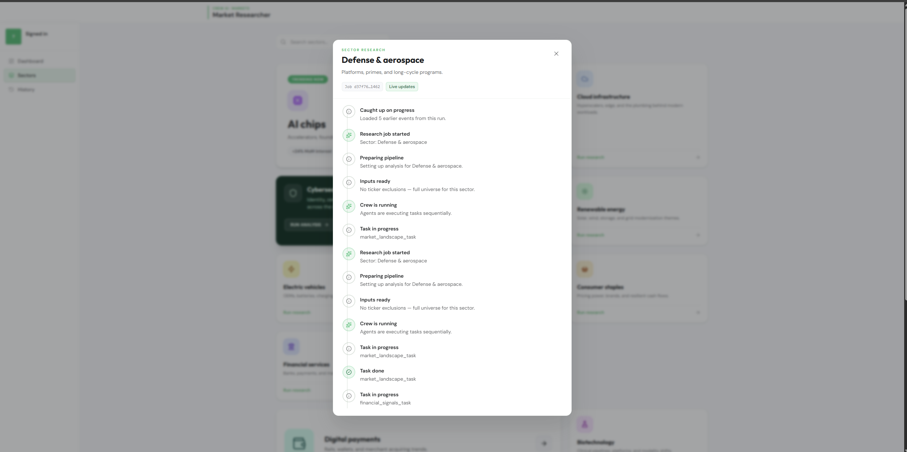
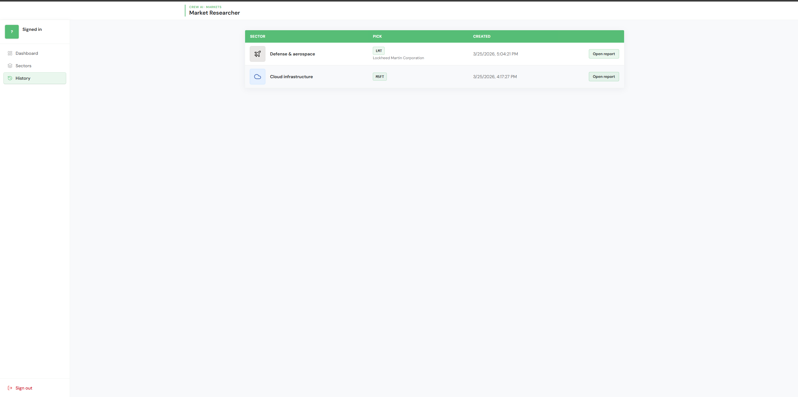

# Stock analyst — Crew AI

This repository hosts an **agentic stock / sector research** system built with [CrewAI](https://docs.crewai.com). A multi-agent crew researches a user-chosen **sector**, uses **web search** for current public information, and produces a **structured investment recommendation** (with appropriate research-only framing).

## What's in this repo

The runnable application lives in **`market_researcher/`** (Python package `market-researcher`). That subproject includes:

- **CrewAI pipeline:** three sequential agents (market researcher → financial analyst → investment strategist), YAML-defined roles/tasks, **Serper** for search, and **Google Gemini** as the LLM.
- **FastAPI service:** async research jobs, WebSocket progress, SQLite persistence, JWT auth options, and sector-level ticker exclusion (see the subproject README for detail).

For setup, environment variables, CLI vs API usage, and architecture diagrams, see [`market_researcher/README.md`](market_researcher/README.md).

## UI

The **`frontend/`** SPA talks to the API over HTTP and WebSockets. Setup: [`frontend/README.md`](frontend/README.md).

### Screenshots

#### Sign-in (Auth0 / Google)

#### Dashboard

#### Sectors

#### Research run (progress)

#### History

## Authentication (Auth0 OIDC + optional Google)

The UI uses [Auth0](https://auth0.com) (OpenID Connect) for sign-in. Access tokens are validated on the API with **`JWT_JWKS_URL`**, **`JWT_ISSUER`**, and **`JWT_AUDIENCE`** (see [`market_researcher/.env.example`](market_researcher/.env.example) and [`frontend/.env.example`](frontend/.env.example)).

### Auth0 tenant (SPA + API)

1. **Auth0 Dashboard:** [https://manage.auth0.com/](https://manage.auth0.com/)
2. **Application** — create a **Single Page Application**. Copy its **Client ID** into `VITE_AUTH0_CLIENT_ID` (frontend `.env`).
3. **APIs** — create an API. Set **Identifier** to **`https://market-researcher-api`** (or change both `.env` files to the same custom Identifier). **This is required:** without an API audience, Auth0 returns **opaque** tokens and this backend returns **401**.
4. **Application URLs** (SPA app settings):
   - **Allowed Callback URLs:** `http://localhost:3000`, `http://localhost:3000/` (plus production origins). Must match `redirect_uri` (app uses `window.location.origin`).
   - **Allowed Logout URLs:** include `http://localhost:3000/login` (and production equivalents).
   - **Allowed Web Origins:** your SPA origins.
5. **Refresh tokens (optional):** In the SPA application, enable **Refresh Token Rotation** under **Application → Settings**, then set **`VITE_AUTH0_USE_REFRESH_TOKENS=true`** in `frontend/.env`. If rotation is **not** enabled, leave that unset (default); otherwise **`POST .../oauth/token`** may return **403**.

### Sign in with Google (via Auth0)

Google credentials belong in **Auth0**, not in `VITE_AUTH0_CLIENT_ID` (that value is always the Auth0 SPA client ID).

1. **Google Cloud Console** — [APIs & Services → Credentials](https://console.cloud.google.com/apis/credentials): create an **OAuth 2.0 Client ID** (Web application).
2. **Authorized redirect URIs:** `https://<YOUR_AUTH0_DOMAIN>/login/callback` (Auth0 shows this under **Authentication → Social → Google**).
3. **Authorized JavaScript origins:** `https://<YOUR_AUTH0_DOMAIN>` (no path, no trailing slash).
4. **Auth0** — **Authentication → Social → Google:** paste Google **Client ID** and **Client secret**; enable the connection for your **SPA** application. Default connection name is **`google-oauth2`** (override with `VITE_AUTH0_GOOGLE_CONNECTION` if you rename it).
5. Complete Google’s **OAuth consent screen** and add test users while in testing mode.

The login page includes **Continue with Google** (direct connection) and **Continue with Auth0** (Universal Login / other IdPs you enable).

### If something breaks

- **SPA:** [`frontend/README.md`](frontend/README.md#troubleshooting-frontend) — wrong client ID, opaque tokens, Auth0 `Service not found`, Google `redirect_uri_mismatch`, token endpoint **403**, 401 after redirect.
- **API:** [`market_researcher/README.md`](market_researcher/README.md#auth0--jwt-troubleshooting) — JWKS vs `JWT_SECRET`, audience/issuer, empty user profile, `/userinfo` enrichment.

### Production

Disable **`API_DEV_SKIP_AUTH`**, **`API_DEV_PASSWORD_LOGIN`**, and **`VITE_DEV_PASSWORD_LOGIN`**. Use HTTPS origins in Auth0 and in `CORS_ORIGINS`.
