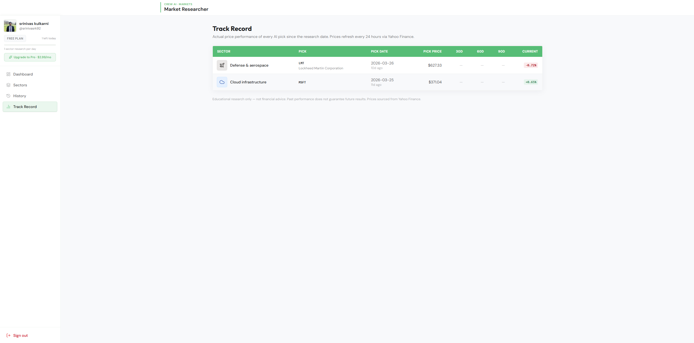
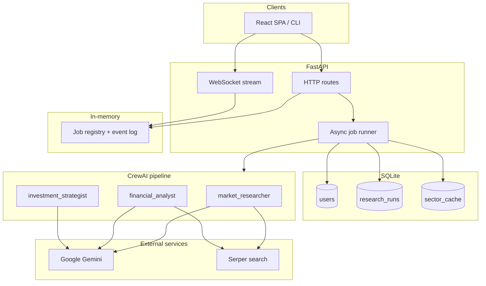
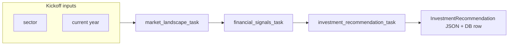

<div align="center">

# 📈 Stock Analyst — AI-Powered Sector Research

**Multi-agent AI that researches a market sector, ranks the top 3 stocks, and explains exactly why — in seconds.**

[](https://stocks.srini.fyi)
[](https://www.python.org/)
[](https://docs.crewai.com)
[](LICENSE)
[](market_researcher/Dockerfile)

<br/>

> **For research and education only.** Not financial advice.

<br/>

[**Try it free →**](https://stocks.srini.fyi) &nbsp;·&nbsp; [Self-host it](#self-hosting) &nbsp;·&nbsp; [View the API docs](https://stocks.srini.fyi/docs)

</div>

---

## What it does

Stock Analyst runs a **three-agent AI crew** (powered by [CrewAI](https://docs.crewai.com) + Google Gemini) that takes any investable sector — *Semiconductors, Clean Energy, AI Infrastructure, Healthcare* — searches the live web, crunches public financial signals, and returns a structured **🥇 🥈 🥉 podium** of the three best stocks. Every pick is explained with head-to-head reasoning, and your history is tracked against real 30/60/90-day price returns so you can see how the AI performs over time.

**The crew pipeline:**

```
Market Researcher  ──►  Financial Analyst  ──►  Investment Strategist
   (live search)          (signal scoring)         (ranked output)
```

---

## Features

| | Feature | Notes |
|---|---|---|
| 🤖 | **3-agent AI pipeline** | Market researcher → financial analyst → investment strategist, fully automated |
| 🏆 | **Ranked top-3 podium** | 🥇🥈🥉 with head-to-head reasoning at each rank |
| 🌐 | **Live web search** | Serper-powered search on every run — no stale training data |
| 📊 | **Track record** | Past AI picks vs actual 30/60/90-day Yahoo Finance returns |
| 📄 | **PDF export** | Download any report as a formatted PDF — no print dialog |
| ⚡ | **Real-time progress** | WebSocket streaming shows the crew thinking live |
| 🔐 | **Auth0 + Google sign-in** | OIDC, opaque-token safe, JWT validated on every request |
| 🐳 | **Docker-ready** | One command to self-host on Fly.io, AWS Lightsail, or any VPS |
| 🗄️ | **SQLite persistence** | All runs stored; history survives restarts |

---

## Plans

Stock Analyst is free to try. Pro unlocks unlimited daily research and advanced features.

| | Free | Pro — $2.99 / mo |
|---|:---:|:---:|
| Sector research runs per day | **1** | **Unlimited** |
| All 15 sectors | ✅ | ✅ |
| 🥇🥈🥉 ranked picks + reasoning | ✅ | ✅ |
| Track record (30 / 60 / 90-day returns) | ✅ | ✅ |
| PDF export | ✅ | ✅ |
| Real-time WebSocket progress | ✅ | ✅ |
| Email on completion | — | ✅ *(coming soon)* |
| Weekly sector digest | — | ✅ *(coming soon)* |
| Watchlist ±5% alerts | — | ✅ *(coming soon)* |
| Priority queue (no cold starts) | — | ✅ *(coming soon)* |

> **Pro is in early access.** [Join the waitlist](mailto:srinivasrk92@gmail.com?subject=Stock%20Analyst%20Pro%20Waitlist) — it's free and you'll be first in line.

---

## Screenshots

<table>
  <tr>
    <td align="center"><b>Sign-in</b></td>
    <td align="center"><b>Dashboard</b></td>
  </tr>
  <tr>
    <td></td>
    <td></td>
  </tr>
  <tr>
    <td align="center"><b>Sector selection</b></td>
    <td align="center"><b>Live research progress</b></td>
  </tr>
  <tr>
    <td></td>
    <td></td>
  </tr>
  <tr>
    <td align="center"><b>History</b></td>
    <td align="center"><b>Track record</b></td>
  </tr>
  <tr>
    <td></td>
    <td></td>
  </tr>
</table>

---

## Getting started

### Option A — Use the hosted app

No setup required. [**Sign in at stocks.srini.fyi**](https://stocks.srini.fyi) with Google and you're researching in under 30 seconds.

### Option B — Self-host with Docker

```bash
# 1. Clone
git clone https://github.com/your-org/stock-analyst.git
cd stock-analyst/market_researcher

# 2. Configure
cp .env.example .env
# Fill in: GEMINI_API_KEY, SERPER_API_KEY, JWT_JWKS_URL, JWT_ISSUER, JWT_AUDIENCE, CORS_ORIGINS

# 3. Run
docker build -t stock-analyst .
docker run -p 8000:8000 --env-file .env stock-analyst
```

The API is now live at `http://localhost:8000`.
OpenAPI docs: [`http://localhost:8000/docs`](http://localhost:8000/docs)

**Then start the frontend:**

```bash
cd ../frontend
cp .env.example .env          # set VITE_AUTH0_* and VITE_API_URL
npm install && npm run dev    # http://localhost:3000
```

> Full deployment guide (Fly.io, HTTPS, env vars): [`docs/HOSTING_stocks.srini.fyi.md`](docs/HOSTING_stocks.srini.fyi.md)

---

## Architecture

### System components



### Crew task flow



### Sector cache (cost control)

Results are cached per sector for 24 hours and shared across all users. At most 15 CrewAI runs happen per day (one per sector). Subsequent users get the cached result instantly via the existing WebSocket replay path — no frontend changes required.

```
User clicks sector
       │
       ▼
 Fresh cache hit? ──YES──► Clone run to user history → instant WebSocket replay
       │
       NO
       ▼
 Free user, daily limit reached? ──YES──► 429 + upgrade prompt
       │
       NO
       ▼
 Run CrewAI job → save run → update sector_cache
```

---

## Repository layout

```
stock-analyst/
├── market_researcher/          # Python backend (FastAPI + CrewAI)
│   ├── src/market_researcher/
│   │   ├── api.py              # FastAPI app, JWT auth, jobs, WebSocket
│   │   ├── crew.py             # CrewAI agents, tasks, Gemini LLM, Serper
│   │   ├── db.py               # SQLite: users, research_runs, sector_cache
│   │   ├── schemas.py          # InvestmentRecommendation (Pydantic)
│   │   └── config/
│   │       ├── agents.yaml
│   │       └── tasks.yaml
│   ├── Dockerfile
│   ├── pyproject.toml
│   └── README.md               # Full backend docs, env vars, API reference
├── frontend/                   # React + Vite SPA
│   └── README.md               # Frontend setup and troubleshooting
└── docs/
    ├── HOSTING_stocks.srini.fyi.md   # Production deployment guide
    ├── PLAN_caching_and_freemium.md  # Freemium architecture plan
    └── screenshots/
```

---

## Environment variables

The backend is configured via `market_researcher/.env`. Copy [`.env.example`](market_researcher/.env.example) to get started.

| Variable | Required | Description |
|---|:---:|---|
| `GEMINI_API_KEY` | ✅ | Google Gemini API key |
| `SERPER_API_KEY` | ✅ | Serper web search key |
| `JWT_JWKS_URL` | ✅ | Auth0 JWKS endpoint, e.g. `https://<tenant>.auth0.com/.well-known/jwks.json` |
| `JWT_ISSUER` | ✅ | Auth0 issuer, e.g. `https://<tenant>.auth0.com/` |
| `JWT_AUDIENCE` | ✅ | Auth0 API Identifier — must match `VITE_AUTH0_AUDIENCE` in the frontend |
| `CORS_ORIGINS` | ✅ | Comma-separated allowed origins, e.g. `https://stocks.srini.fyi` |
| `GEMINI_MODEL` | — | Override model; default `gemini/gemini-2.5-flash` |
| `MARKET_RESEARCHER_DB` | — | SQLite path; default `data/app.db` |
| `API_DEV_SKIP_AUTH` | — | `true` to bypass JWT in local dev |
| `API_DEV_PASSWORD_LOGIN` | — | `true` to enable `POST /auth/dev-login` |

> **Production checklist:** disable `API_DEV_SKIP_AUTH`, `API_DEV_PASSWORD_LOGIN`, and `VITE_DEV_PASSWORD_LOGIN`. Use HTTPS origins everywhere.

For the full variable reference and Auth0 setup, see [`market_researcher/README.md`](market_researcher/README.md).

---

## Authentication

Auth0 (OpenID Connect) handles sign-in. Google OAuth is wired through Auth0 — no separate Google credentials in the frontend.

**Quick Auth0 setup:**

1. Create a **Single Page Application** in Auth0 → copy its **Client ID** to `VITE_AUTH0_CLIENT_ID`.
2. Create an **API** in Auth0 → set Identifier to `https://market-researcher-api` → copy to `JWT_AUDIENCE` and `VITE_AUTH0_AUDIENCE`.
3. Set **Allowed Callback / Logout / Web Origins** for your domain.
4. *(Optional)* Add a Post-Login Action to embed profile claims on the access token.

Full walkthrough + troubleshooting table: [`market_researcher/README.md#auth0--jwt`](market_researcher/README.md) and [`frontend/README.md`](frontend/README.md).

---

## API quick reference

| Method | Path | Description |
|---|---|---|
| `GET` | `/health` | Health check |
| `GET` | `/me` | Current user profile (upserts on call) |
| `POST` | `/research` | Start a research job → returns `{ job_id }` |
| `GET` | `/research/jobs/{job_id}` | Job status + result |
| `WS` | `/research/ws/{job_id}` | Live event stream; append `?token=<JWT>` |
| `GET` | `/research/history` | Recent runs for the current user |
| `GET` | `/research/{run_id}` | Single persisted run |
| `POST` | `/auth/dev-login` | Dev-only HS256 token (when `API_DEV_PASSWORD_LOGIN=true`) |

Interactive docs available at `/docs` when the API is running.

---

## Local development (without Docker)

```bash
# Backend
cd market_researcher
python -m venv .venv && source .venv/bin/activate   # Windows: .venv\Scripts\activate
pip install -e .
cp .env.example .env    # fill in keys; set API_DEV_SKIP_AUTH=true for local
uvicorn market_researcher.api:app --reload --port 8000

# Frontend (separate terminal)
cd frontend
npm install
cp .env.example .env    # set VITE_AUTH0_* and VITE_API_URL=http://localhost:8000
npm run dev             # http://localhost:3000
```

**Run the crew from the CLI (no API needed):**

```bash
cd market_researcher
run_crew                # researches the default sector
python -m market_researcher.main  # same
```

---

## Disclaimers

All research output is generated by AI using publicly available information and is provided **for educational and research purposes only**. It is **not financial advice**. Past AI picks tracked against actual returns are shown for transparency, not as a guarantee of future performance. Always do your own due diligence before making investment decisions.

---

<div align="center">

Built with [CrewAI](https://docs.crewai.com) · [Google Gemini](https://deepmind.google/technologies/gemini/) · [FastAPI](https://fastapi.tiangolo.com) · [Auth0](https://auth0.com)

**[Try it free at stocks.srini.fyi →](https://stocks.srini.fyi)**

</div>
