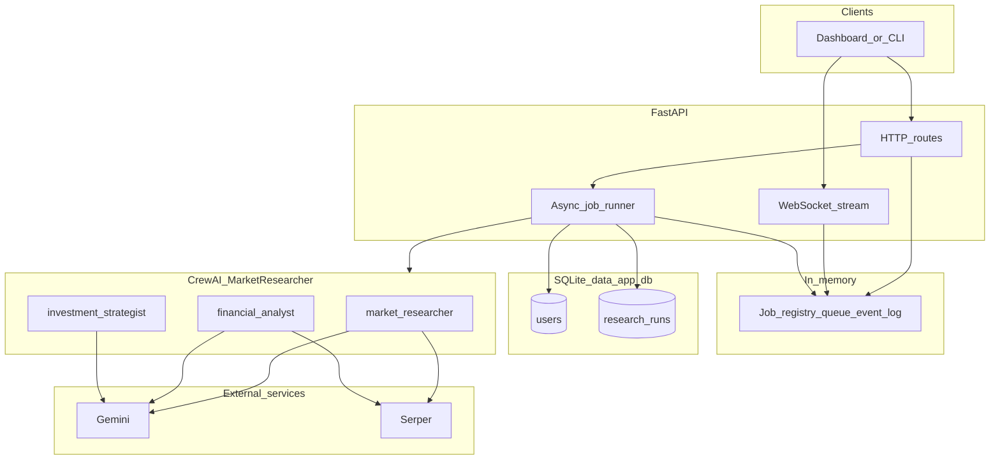
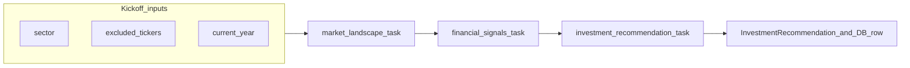

# Market Researcher (CrewAI)

Multi-agent market research pipeline: given a **sector** (any investable theme—technology, healthcare, energy, etc.), a CrewAI crew runs **live web search**, synthesizes **public financial signals**, and returns a **structured investment recommendation** (Pydantic JSON). A **FastAPI** service adds **SQLite persistence**, **per-user exclusion TTL** (don’t repeat the same primary ticker for the same sector within 24 hours), **JWT auth**, and **async jobs with WebSocket** progress for frontends.

## Features

- **Three sequential agents:** market researcher → financial analyst → investment strategist ([`config/agents.yaml`](src/market_researcher/config/agents.yaml), [`config/tasks.yaml`](src/market_researcher/config/tasks.yaml)).
- **Tools:** [Serper](https://serper.dev) (`SERPER_API_KEY`) for web search on the first two agents.
- **LLM:** Google **Gemini** via CrewAI (`GEMINI_API_KEY`, default model `gemini/gemini-2.5-flash`; override with `GEMINI_MODEL`).
- **Structured final output:** [`InvestmentRecommendation`](src/market_researcher/schemas.py) (`output_pydantic`); report file [`investment_report.json`](investment_report.json) is written relative to the process working directory when the crew runs.
- **API:** User profiles and research runs in **SQLite** ([`data/app.db`](data/app.db) by default); `POST /research` returns a **`job_id`** immediately; **`WebSocket /research/ws/{job_id}`** streams progress and supports **replay** for late connections.
- **Auth:** Bearer **JWT** only. **HS256** dev tokens use `JWT_SECRET`; **Auth0 / OIDC** access tokens use **RS256** and require `JWT_JWKS_URL` + `JWT_ISSUER` (+ `JWT_AUDIENCE` matching the SPA). **Opaque** Auth0 tokens (no API audience) are rejected with a clear error. Local: `API_DEV_SKIP_AUTH=true` or `POST /auth/dev-login` when enabled.

## System architecture

High-level components and data flow (API path). The CLI skips FastAPI and calls the crew directly with the same YAML config.



Sequential crew (tasks). The strategist produces structured `InvestmentRecommendation` JSON; prior tasks produce markdown context.



## Requirements

- Python **≥ 3.10, &lt; 3.14**
- **`.env`** in **this directory** (`market_researcher/.env`, next to `pyproject.toml`). [`api.py`](src/market_researcher/api.py) loads it via `load_dotenv` on startup.

### Environment variables (common)

| Variable | Purpose |
|----------|---------|
| `GEMINI_API_KEY` | Gemini API |
| `SERPER_API_KEY` | Serper web search |
| `GEMINI_MODEL` | Optional; default `gemini/gemini-2.5-flash` (with `gemini/` prefix if omitted) |
| `MARKET_RESEARCHER_DB` | Optional; SQLite path. Default: `data/app.db` under this project |
| `CORS_ORIGINS` | Comma-separated origins for the API (e.g. `http://localhost:3000`) |
| `API_DEV_SKIP_AUTH` | `true` / `1` to skip JWT (dev only) |
| `API_DEV_USER_SUB` | Optional synthetic `sub` when dev auth is on |
| `API_DEV_PASSWORD_LOGIN` | `true` / `1` to enable `POST /auth/dev-login` (dev only; returns 404 when off) |
| `DEV_LOGIN_USER` / `DEV_LOGIN_PASSWORD` | Credentials for dev login (default `admin` / `admin`) |
| `DEV_LOGIN_SUB` / `DEV_LOGIN_EMAIL` / `DEV_LOGIN_NAME` | Claims embedded in dev JWT |
| `DEV_LOGIN_USERNAME` | Optional; sets `preferred_username` on dev JWT (stored as `users.username`) |
| `DEV_LOGIN_TOKEN_TTL_SECONDS` | Dev JWT lifetime (default 8 hours) |
| `JWT_SECRET` | Random string for **signing/verifying HS256** tokens from `POST /auth/dev-login`. **Not** your Auth0 Client Secret; Auth0 RS256 tokens are verified with JWKS, not this secret. |
| `JWT_JWKS_URL` | e.g. `https://<tenant>.auth0.com/.well-known/jwks.json` — **required** for Auth0 access JWTs. |
| `JWT_ISSUER` | e.g. `https://<tenant>.auth0.com/` — must match token `iss` (trailing slash normalized during verify). |
| `JWT_AUDIENCE` | **Auth0 API Identifier** — must match **`VITE_AUTH0_AUDIENCE`** on the SPA. **Required** for JWT access tokens; without it the SPA may get opaque tokens and the API cannot verify them. |
| `JWT_LEEWAY_SECONDS` | Optional; default `60` — clock skew leeway for `exp` / `nbf` |
| `AUTH0_USERINFO_ENRICH` | Default `true`. If claims lack email/name after JWT verify, **GET** `{issuer}/userinfo` with the same Bearer token and merge profile fields (typical when the access JWT only has `sub` / `scope` but `aud` includes `.../userinfo`). Set `false` to disable. |
| `JWT_DEBUG_ERRORS` | Optional; if `true` / `1`, **401** responses may include PyJWT error detail (dev only). |

Copy [`.env.example`](.env.example) to `.env` in this directory and fill in values. For Auth0 + Google and SPA env vars, see the repo root [`README.md`](../README.md#authentication-auth0-oidc--optional-google).

### User profile in SQLite (`users` table)

Every authenticated HTTP call to **`GET /me`**, research routes, job status, history, run detail, and WebSocket connect runs **`upsert_user_from_claims`**: email, name, username (`preferred_username` / `nickname` / `username`), given/family name, picture URL, provider, and a JSON snapshot of claims (`raw_claims_json`, truncated) are written to **`users`**.

Auth0 **API access tokens** often include only `sub` until you add profile claims. In Auth0, add a **Post-Login Action** (trigger *Login / Post Login*) that runs when your API is authorized, for example:

```javascript
exports.onExecutePostLogin = async (event, api) => {
  if (event.authorization) {
    api.accessToken.setCustomClaim("email", event.user.email);
    api.accessToken.setCustomClaim("email_verified", event.user.email_verified);
    api.accessToken.setCustomClaim("name", event.user.name);
    api.accessToken.setCustomClaim("given_name", event.user.given_name);
    api.accessToken.setCustomClaim("family_name", event.user.family_name);
    api.accessToken.setCustomClaim("picture", event.user.picture);
    api.accessToken.setCustomClaim(
      "preferred_username",
      event.user.username || event.user.nickname,
    );
  }
};
```
(Adjust to match your Auth0 Action API version; Google logins often fill `nickname`.) Namespaced keys in the JWT (URL ending with `email`, `picture`, etc.) are also mapped.

**Default behavior:** with **`AUTH0_USERINFO_ENRICH`** left on, you usually **do not** need this Action for SQLite profile rows; the API fills email/name from `/userinfo` when the JWT is sparse.

## Auth0 & JWT troubleshooting

These are issues that commonly appear when wiring the SPA + FastAPI to Auth0.

| Symptom | Cause | What to do |
| --- | --- | --- |
| **401** on `/me`, `/research/*`; logs show **Unauthorized** | **Opaque** access token (not a JWT), or verification failed. | Set **`JWT_AUDIENCE`** here and **`VITE_AUTH0_AUDIENCE`** in the frontend to the **same** Auth0 API **Identifier**. Create that API under Auth0 → Applications → **APIs**. Restart API + SPA; **sign in again**. |
| Error body: *Access token is not a JWT…* | No API audience → Auth0 returned an opaque token. | Same as above — audience is **mandatory** for this backend. |
| **401** while `JWT_SECRET` is set but no `JWT_JWKS_URL` | Auth0 tokens are **RS256**. The server tried to verify them with **HS256** + secret. | Set **`JWT_JWKS_URL`** and **`JWT_ISSUER`** for your tenant. Keep `JWT_SECRET` for dev-login only. |
| **`Service not found: https://…`** (browser, after login) | The **Identifier** in `VITE_AUTH0_AUDIENCE` does not exist in Auth0 **APIs**. | Create an API with that Identifier, or change both env files to match an existing one **exactly**. |
| **Invalid issuer** / `iss` mismatches | Env typo or trailing slash vs token. | [`api.py`](src/market_researcher/api.py) normalizes trailing slashes; ensure **`JWT_ISSUER`** matches your tenant (usually `https://<domain>/`). |
| **User row has empty `email` / `name` but `sub` is set** | Many Auth0 access JWTs omit profile; scopes live in `scope` but claims are not in the JWT. | Leave **`AUTH0_USERINFO_ENRICH`** enabled (default) so the API calls **`/userinfo`**. Or add a Post-Login Action to put profile on the access token (see above). |
| Dev login **401** with **`JWT_ISSUER`** set | Dev JWT must include **`iss`** if you require issuer check. | `POST /auth/dev-login` adds `iss` / `aud` when those env vars are set; ensure dev token claims match `JWT_ISSUER` / `JWT_AUDIENCE` if you set them. |

**CORS:** `CORS_ORIGINS` must list the SPA origin (e.g. `http://localhost:3000`). **WebSocket** auth uses `?token=<jwt>` on the same host as HTTP.

**Sign out:** If Auth0 says **returnTo** is not allowed, add **`http://localhost:3000/login`** (and prod URLs) to the SPA app’s **Allowed Logout URLs** in Auth0.

More SPA-side notes: [`frontend/README.md`](../frontend/README.md#troubleshooting-frontend).

## Installation

From the project root (directory containing `pyproject.toml`):

```bash
python -m venv .venv
.venv\Scripts\activate   # Windows
pip install -e .
```

Or use [uv](https://docs.astral.sh/uv/) / `crewai install` if you prefer.

## Run the crew only (CLI)

Loads `.env` from the project root, default sector e.g. `"AI chips"`:

```bash
run_crew
# or
python -m market_researcher.main
# or
crewai run
```

For a custom sector from code, call `run_stock_research("Your sector")` in `main.py` or import it elsewhere. Crew tool cache stays **enabled** for CLI (`cache=True` default on [`MarketResearcher.crew()`](src/market_researcher/crew.py)).

## Run the HTTP API

The package lives under `src/market_researcher/`. **Install it into your venv first** (once per environment), otherwise you will see `ModuleNotFoundError: No module named 'market_researcher'`:

```bash
# from this directory (market_researcher/), with your venv activated
uv sync
# or, if you use pip in the venv:
pip install -e .
# or, with uv but no full sync:
uv pip install -e .
```

Then start Uvicorn (from the same `market_researcher/` directory is fine):

```bash
.venv\Scripts\python.exe -m uvicorn market_researcher.api:app --reload --host 127.0.0.1 --port 8000
```

Or use the console script after an editable install:

```bash
market_researcher_api
```

**Workaround without installing:** set `PYTHONPATH` to the `src` folder (PowerShell: `$env:PYTHONPATH = "src"`) for the same `python -m uvicorn ...` command.

- **OpenAPI docs:** `http://127.0.0.1:8000/docs`
- **Health:** `GET /health`

### API quick reference

| Method | Path | Description |
|--------|------|-------------|
| `POST` | `/auth/dev-login` | Body: `{"username","password"}`. Returns HS256 JWT when `API_DEV_PASSWORD_LOGIN` is on; **404** when disabled |
| `GET` | `/me` | Upsert user from JWT (or dev claims); returns profile |
| `POST` | `/research` | Body: `{"sector": "...", "session_id": "optional"}`. Returns `{"job_id": "<uuid>"}` |
| `GET` | `/research/jobs/{job_id}` | Job status and result fields when finished |
| `WS` | `/research/ws/{job_id}` | Live events; use `?token=<JWT>` if not using dev auth |
| `GET` | `/research/history` | Recent runs for the current user |
| `GET` | `/research/{run_id}` | One persisted run (SQLite `research_runs.id`) |

**WebSocket:** Do not open `ws://...` in the Chrome address bar. Use the DevTools console (`new WebSocket(...)`), Postman’s WebSocket tab, or your frontend.

### Example: start research then stream (dev auth)

```bash
curl -X POST http://127.0.0.1:8000/research -H "Content-Type: application/json" -d "{\"sector\":\"Semiconductors\"}"
```

Connect to `ws://127.0.0.1:8000/research/ws/<job_id>` with the returned UUID.

## Project layout

```
market-researcher/
├── pyproject.toml
├── .env                 # not committed; API keys and flags
├── data/                # gitignored; default SQLite
├── src/market_researcher/
│   ├── api.py           # FastAPI app, JWT, jobs, WebSocket
│   ├── main.py          # CLI entry
│   ├── crew.py          # CrewBase: agents, tasks, Serper tool, Gemini LLM
│   ├── db.py            # SQLite: users, research_runs, exclusions TTL (1 day)
│   ├── schemas.py       # InvestmentRecommendation (Pydantic)
│   ├── config/
│   │   ├── agents.yaml
│   │   └── tasks.yaml
│   └── services/
│       ├── research_service.py  # kickoff, exclusions, persistence
│       └── research_jobs.py     # in-memory job queues + replay log
```

## Notes

- **Not financial advice:** outputs are for research / education only; add your own compliance and disclaimers for production.
- **Jobs are in-memory:** restarting the API clears active `job_id` streams; completed runs remain in SQLite.

## References

- [CrewAI documentation](https://docs.crewai.com)
