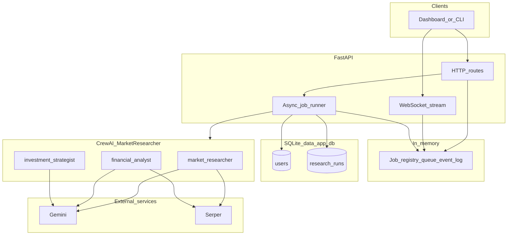
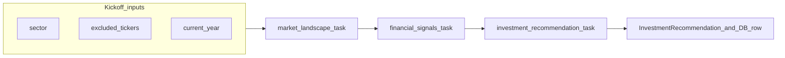

# Market Researcher (CrewAI)

Multi-agent market research pipeline: given a **sector** (any investable theme—technology, healthcare, energy, etc.), a CrewAI crew runs **live web search**, synthesizes **public financial signals**, and returns a **structured investment recommendation** (Pydantic JSON). A **FastAPI** service adds **SQLite persistence**, **per-user exclusion TTL** (don’t repeat the same primary ticker for the same sector within 24 hours), **JWT auth**, and **async jobs with WebSocket** progress for frontends.

## Features

- **Three sequential agents:** market researcher → financial analyst → investment strategist ([`config/agents.yaml`](src/market_researcher/config/agents.yaml), [`config/tasks.yaml`](src/market_researcher/config/tasks.yaml)).
- **Tools:** [Serper](https://serper.dev) (`SERPER_API_KEY`) for web search on the first two agents.
- **LLM:** Google **Gemini** via CrewAI (`GEMINI_API_KEY`, default model `gemini/gemini-2.5-flash`; override with `GEMINI_MODEL`).
- **Structured final output:** [`InvestmentRecommendation`](src/market_researcher/schemas.py) (`output_pydantic`); report file [`investment_report.json`](investment_report.json) is written relative to the process working directory when the crew runs.
- **API:** User profiles and research runs in **SQLite** ([`data/app.db`](data/app.db) by default); `POST /research` returns a **`job_id`** immediately; **`WebSocket /research/ws/{job_id}`** streams progress and supports **replay** for late connections.
- **Auth:** Bearer JWT (HS256 + `JWT_SECRET` or JWKS + `JWT_JWKS_URL`). Local testing: `API_DEV_SKIP_AUTH=true` skips JWT (do not use in production).

## System architecture

High-level components and data flow (API path). The CLI skips FastAPI and calls the crew directly with the same YAML config.



Sequential crew (tasks). The strategist produces structured `InvestmentRecommendation` JSON; prior tasks produce markdown context.



## Requirements

- Python **≥ 3.10, &lt; 3.14**
- API keys in **`.env`** at the project root (next to `pyproject.toml`)

### Environment variables (common)

| Variable | Purpose |
|----------|---------|
| `GEMINI_API_KEY` | Gemini API |
| `SERPER_API_KEY` | Serper web search |
| `GEMINI_MODEL` | Optional; default `gemini/gemini-2.5-flash` (with `gemini/` prefix if omitted) |
| `MARKET_RESEARCHER_DB` | Optional; SQLite path. Default: `data/app.db` under this project |
| `CORS_ORIGINS` | Comma-separated origins for the API (e.g. `http://localhost:3000`) |
| `API_DEV_SKIP_AUTH` | `true` / `1` to skip JWT (dev only) |
| `API_DEV_USER_SUB` | Optional synthetic `sub` when dev auth is on |
| `JWT_SECRET` / `JWT_JWKS_URL` | Production token verification (see [`api.py`](src/market_researcher/api.py)) |

## Installation

From the project root (directory containing `pyproject.toml`):

```bash
python -m venv .venv
.venv\Scripts\activate   # Windows
pip install -e .
```

Or use [uv](https://docs.astral.sh/uv/) / `crewai install` if you prefer.

## Run the crew only (CLI)

Loads `.env` from the project root, default sector e.g. `"AI chips"`:

```bash
run_crew
# or
python -m market_researcher.main
# or
crewai run
```

For a custom sector from code, call `run_stock_research("Your sector")` in `main.py` or import it elsewhere. Crew tool cache stays **enabled** for CLI (`cache=True` default on [`MarketResearcher.crew()`](src/market_researcher/crew.py)).

## Run the HTTP API

```bash
.venv\Scripts\python.exe -m uvicorn market_researcher.api:app --reload --host 127.0.0.1 --port 8000
```

Or after `pip install -e .`:

```bash
market_researcher_api
```

- **OpenAPI docs:** `http://127.0.0.1:8000/docs`
- **Health:** `GET /health`

### API quick reference

| Method | Path | Description |
|--------|------|-------------|
| `GET` | `/me` | Upsert user from JWT (or dev claims); returns profile |
| `POST` | `/research` | Body: `{"sector": "...", "session_id": "optional"}`. Returns `{"job_id": "<uuid>"}` |
| `GET` | `/research/jobs/{job_id}` | Job status and result fields when finished |
| `WS` | `/research/ws/{job_id}` | Live events; use `?token=<JWT>` if not using dev auth |
| `GET` | `/research/history` | Recent runs for the current user |
| `GET` | `/research/{run_id}` | One persisted run (SQLite `research_runs.id`) |

**WebSocket:** Do not open `ws://...` in the Chrome address bar. Use the DevTools console (`new WebSocket(...)`), Postman’s WebSocket tab, or your frontend.

### Example: start research then stream (dev auth)

```bash
curl -X POST http://127.0.0.1:8000/research -H "Content-Type: application/json" -d "{\"sector\":\"Semiconductors\"}"
```

Connect to `ws://127.0.0.1:8000/research/ws/<job_id>` with the returned UUID.

## Project layout

```
market-researcher/
├── pyproject.toml
├── .env                 # not committed; API keys and flags
├── data/                # gitignored; default SQLite
├── src/market_researcher/
│   ├── api.py           # FastAPI app, JWT, jobs, WebSocket
│   ├── main.py          # CLI entry
│   ├── crew.py          # CrewBase: agents, tasks, Serper tool, Gemini LLM
│   ├── db.py            # SQLite: users, research_runs, exclusions TTL (1 day)
│   ├── schemas.py       # InvestmentRecommendation (Pydantic)
│   ├── config/
│   │   ├── agents.yaml
│   │   └── tasks.yaml
│   └── services/
│       ├── research_service.py  # kickoff, exclusions, persistence
│       └── research_jobs.py     # in-memory job queues + replay log
```

## Notes

- **Not financial advice:** outputs are for research / education only; add your own compliance and disclaimers for production.
- **Jobs are in-memory:** restarting the API clears active `job_id` streams; completed runs remain in SQLite.

## References

- [CrewAI documentation](https://docs.crewai.com)
